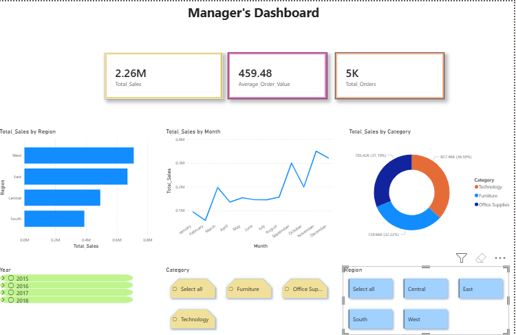
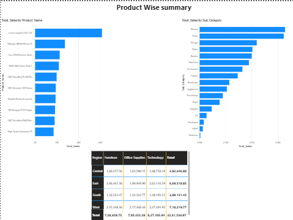

# Sales-Performance-Business-Analysis
Sales performance analysis using SQL Server, Excel and Power BI

# Sales Performance & Regional Business Analysis

## 📌 Objective
To analyze retail sales data and identify region-wise and product-wise performance trends, enabling data-driven business decisions.

---

## 🧰 Tools Used
- Excel (Data validation and KPI checks)
- SQL Server (Business-level data analysis)
- Power BI (Interactive dashboards)
- Power Query (Data cleaning and transformation)

---

## 📊 Dataset
Retail sales dataset containing order-level sales information including region, category, sub-category and sales value.

---

## 🔍 Key Analysis Performed
- Region-wise sales performance analysis
- Category and sub-category contribution analysis
- Monthly sales trend analysis
- Top and bottom product performance

---

## 📈 Power BI Dashboard
### Executive Overview

### Product Performance

---

## 💡 Key Insights
- Certain regions contribute a majority of total sales, indicating regional dependency.
- A small set of sub-categories drive a large share of revenue (Pareto effect).
- Seasonal sales trends are visible across months.
- Some products show high sales volatility requiring management attention.

---

## 🧠 Business Recommendations
- Focus marketing and sales efforts on underperforming regions.
- Optimize product assortment based on revenue contribution.
- Align inventory planning with observed seasonality.
- Monitor low-performing products for pricing or promotional adjustments.
